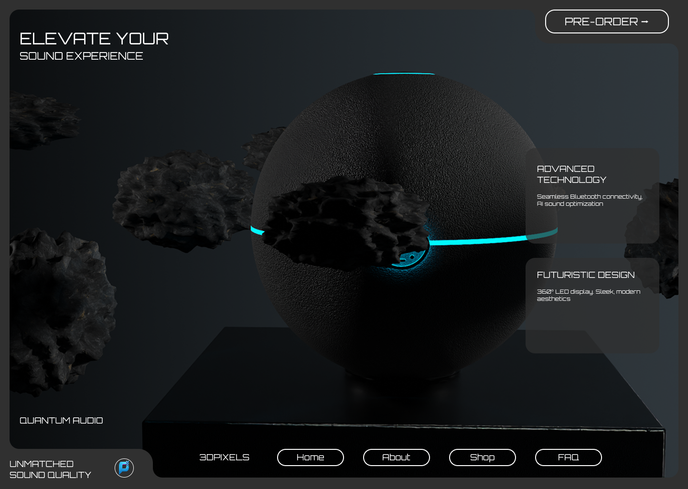

# 🚀 Futuristic Landing Page – 3DPIXELS

A **pixel-perfect**, modern, and animated landing page built with **React**, **Tailwind CSS v4**, and **Framer Motion**. Inspired by futuristic tech design — this page delivers an immersive visual experience with smooth animations and bold typography.

---

### ✨ Features

- 🔳 Fixed layout (desktop-first)
- 🎞️ Smooth entrance animations using **Framer Motion**
- 🌀 Futuristic background and design elements
- 👨‍💻 Google Font: `Orbitron` for tech-style typography
- 🎨 Custom color theme (`#2f2f2f` base)
- 🧠 No external UI kits
- ⚡ Fast Vite + Tailwind v4 setup

---

### 📸 Preview



---

### 🛠 Tech Stack

| Tool | Description |
|------|-------------|
| **React** | UI framework |
| **Vite** | Lightning-fast dev server |
| **Tailwind CSS v4** | Utility-first styling |
| **Framer Motion** | Component-level animation |
| **Lucide React** | Icons (e.g., `ArrowRight`) |

---

### 🖋️ Font

- **Font Used:** [`Orbitron`](https://fonts.google.com/specimen/Orbitron)
- **Why?** Bold, futuristic, ideal for tech products.
- **How it’s loaded:**
```html
<link href="https://fonts.googleapis.com/css2?family=Orbitron:wght@400;700&display=swap" rel="stylesheet" />

📁 Folder Structure
Futuristic-Tech-Website/
├── src/
│   ├── assets/
│   ├── components/
│   │   └── FuturisticLanding.jsx
│   ├── index.css
│   └── main.jsx
├── public/
└── index.html
```

📦 Installation
# Clone the repo
git clone https://github.com/Patypatii/Futuristic-Tech-Website.git
cd Futuristic-Tech-Website

# Install dependencies
npm install

# Run development server
npm run dev

---
🌟 Give a Star
If you like this project, please consider giving it a star on GitHub — it helps others discover it and keeps me motivated! 🙌

[⭐ Star this repo](https://github.com/Patypatii/Futuristic-Tech-Website)
